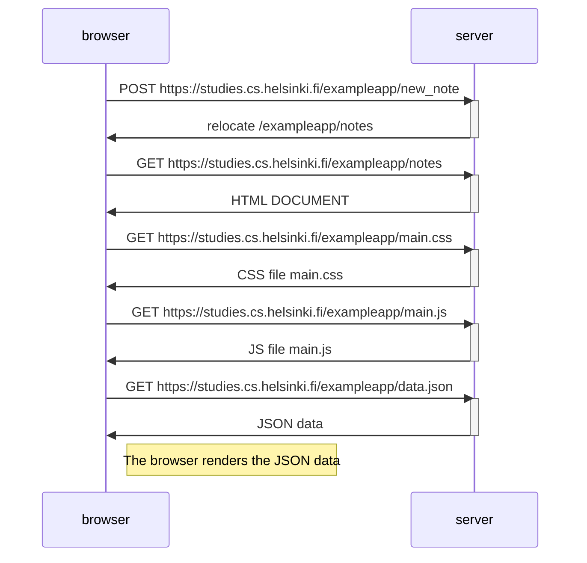

```mermaid
sequenceDiagram
    participant browser
    participant server

    
    browser->>server: POST  https://studies.cs.helsinki.fi/exampleapp/new_note
    activate server
    server->>browser: relocate /exampleapp/notes
    deactivate server

    browser->>server: GET  https://studies.cs.helsinki.fi/exampleapp/notes
    activate server
    server->>browser: HTML DOCUMENT
    deactivate server
    

    browser->>server: GET  https://studies.cs.helsinki.fi/exampleapp/main.css
    activate server
    server->>browser: CSS file main.css
    deactivate server

    browser->>server: GET  https://studies.cs.helsinki.fi/exampleapp/main.js
    activate server
    server->>browser: JS file main.js
    deactivate server

    browser->>server: GET  https://studies.cs.helsinki.fi/exampleapp/data.json
    activate server
    server->>browser: JSON data
    deactivate server
    Note right of browser: The browser renders the JSON data
```