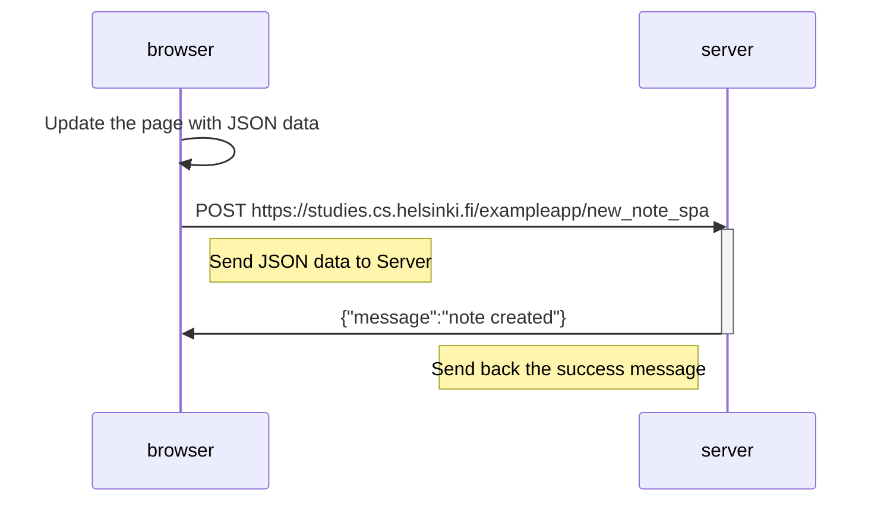

```mermaid
sequenceDiagram
    participant browser
    participant server

    browser->>browser: Update the page with JSON data
    browser->>server: POST  https://studies.cs.helsinki.fi/exampleapp/new_note_spa
    activate server
    note right of browser: Send JSON data to Server  
    server->>browser: {"message":"note created"}
    deactivate server
    note left of server: Send back the success message
```